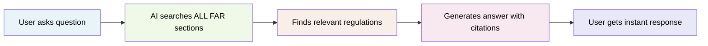

# FAR Chatbot - Executive Overview

## What We Built

The FAR Chatbot is an **AI-powered assistant** that instantly answers Federal Acquisition Regulation questions. Instead of spending time searching through thousands of pages of regulations, government employees can now ask questions in plain English and get accurate, cited answers in seconds.

**Bottom Line**: We've turned the entire FAR into a conversational AI that anyone can use.

## How It Works (Simple Flow)

**Example**: 
- **User asks**: "What are small business set-aside requirements?"
- **System finds**: FAR sections 19.502, 19.203, 19.307
- **AI responds**: Clear explanation with exact FAR citations and practical guidance

## Business Impact

### Problem Solved
- **Before**: time spent doing manual research through complex regulations
- **After**: Instant, accurate answers with proper citations

### Key Benefits
- **Time Savings**
- **Accuracy**: AI-powered search finds the right information every time
- **Compliance**: Proper FAR citations ensure regulatory compliance
- **Accessibility**: Anyone can use it - no FAR expertise required

### User Experience
- Simple chat interface 
- Works on any device 
- Remembers conversation context
- Provides clickable citations to source documents

## Technical Foundation

### What Makes It Smart
- **3,893 FAR sections** pre-processed and indexed
- **AI embeddings** understand context and meaning, not just keywords
- **Retrieval-Augmented Generation (RAG)** ensures answers come from actual FAR content
- **Conversation memory** maintains context across multiple questions

### Current Capabilities
- Answers definitional questions ("What is a small business?")
- Explains processes ("How do I conduct market research?")
- Compares options ("Sealed bidding vs. negotiated procurement?")
- Provides compliance guidance ("What are the requirements for...")
- Maintains conversation flow for follow-up questions

## Risk Management

### Low Risk Profile
- **Proven technology**: Uses established AI and cloud services
- **No sensitive data**: Only processes publicly available FAR content
- **Government compliant**: Built for federal agency requirements
- **Scalable**: Can handle growing user base without major changes

