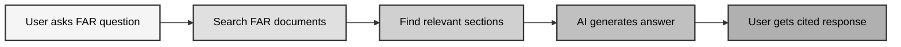
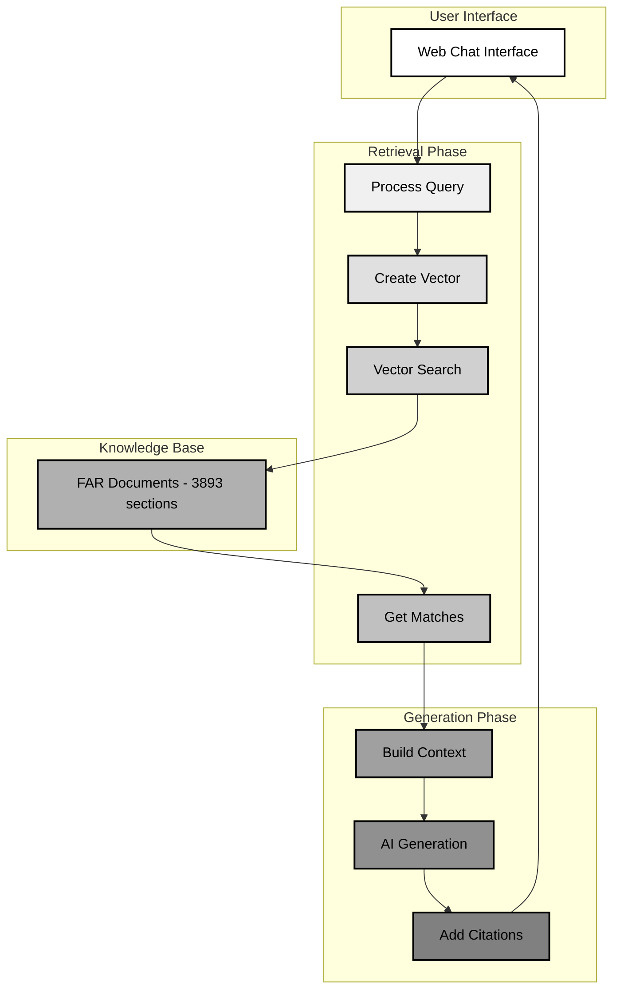
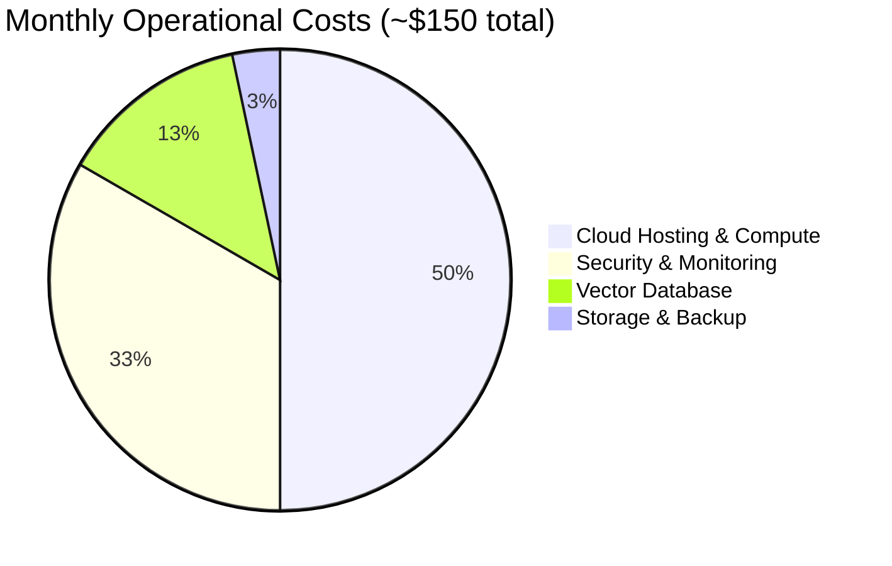

# FAR Chatbot - Executive Overview

## What is the FAR Chatbot?

The FAR Chatbot is an **AI-powered assistant** that helps government employees quickly find answers to Federal Acquisition Regulation (FAR) questions. Instead of manually searching through thousands of pages of regulations, users can ask questions in plain English and get accurate, cited answers in seconds.

## Business Problem & Solution

### The Problem
- **Time-consuming**: Finding FAR information takes hours of manual research
- **Complex language**: Regulations are written in legal jargon that's hard to understand
- **Scattered information**: Relevant rules are spread across multiple documents
- **Human error**: Manual searches can miss important details or citations

### Our Solution
- **Instant answers**: Get responses in 2-5 seconds instead of hours
- **Plain English**: Complex regulations explained in simple terms
- **Proper citations**: Every answer includes exact FAR section references
- **Always available**: 24/7 access through any web browser

## How It Works (Simple View)

### Step-by-Step Process
1. **User asks a FAR question** (e.g., "What are the small business set-aside requirements?")
2. **System searches** through 3,893 FAR document sections using AI embeddings
3. **Finds relevant sections** that match the question context
4. **AI generates** a comprehensive answer using only FAR content
5. **User receives** the answer with exact FAR section citations

## System Architecture (RAG Process)

### RAG (Retrieval-Augmented Generation) Explained
**Retrieval**: Find the most relevant FAR sections for your question
**Augmentation**: Combine your question with the found FAR content  
**Generation**: AI creates an answer using only the retrieved FAR information

## Key Benefits

### For Government Employees
- **Save time**: Hours of research reduced to seconds
- **Get accurate answers**: AI-powered search finds the right information
- **Easy to use**: Simple chat interface, no training required
- **Verify sources**: Every answer includes proper FAR citations

### For Agencies
- **Cost savings**: Reduce time spent on regulatory research
- **Compliance**: Ensure accurate interpretation of regulations
- **Consistency**: Same high-quality answers for all users
- **Productivity**: Free up staff for higher-value work

## Technical Capabilities (Non-Technical)

### What Makes It Smart
- **Understands context**: Knows what you're really asking about
- **Learns from conversation**: Remembers what you discussed earlier
- **Handles complex questions**: Can answer multi-part regulatory questions
- **Provides explanations**: Not just answers, but why the rule exists

## Cost & ROI

### Investment
- **Development**: One-time setup and configuration (already complete)
- **Operations**: ~$150/month for cloud hosting services
- **Maintenance**: Minimal ongoing technical support

### Return on Investment
- **Time savings**: 2-4 hours per employee per week
- **Accuracy improvement**: Reduce compliance errors
- **Training reduction**: Less need for FAR training sessions
- **Productivity gains**: Staff can focus on strategic work

### Cost Comparison

## Success Metrics

### User Experience
- **Response time**: < 3 seconds for 95% of queries
- **User satisfaction**: > 85% positive feedback
- **Adoption rate**: Track daily active users
- **Question complexity**: Monitor types of questions asked

### Business Impact
- **Time saved**: Hours of research time reduced
- **Accuracy**: Reduction in compliance-related errors
- **Usage growth**: Increasing adoption across departments
- **Cost per query**: Decreasing cost as usage scales

## Risk Management

### Low Risk Factors
- **Proven technology**: Uses established AI and cloud services
- **No sensitive data**: Only processes publicly available FAR content
- **Scalable platform**: Can handle growing user base
- **Government compliant**: Built for federal agency requirements

### Mitigation Strategies
- **Backup systems**: Multiple redundancy layers
- **Security monitoring**: 24/7 threat detection
- **Support team**: Dedicated technical support
- **Regular audits**: Ongoing compliance verification

## Next Steps

### For Implementation
1. **Assign project team** (PM, technical lead, users)
2. **Define success criteria** and metrics
3. **Plan user training** and change management
4. **Set up monitoring** and feedback processes

---

*This document provides a high-level overview for business stakeholders. For detailed technical specifications, see the [Production Design Document](production_design.md).*