# FAR Chatbot MVP - Production Design Document

## 1. Overview

### System Description
The FAR Chatbot is a Retrieval-Augmented Generation (RAG) system that provides intelligent assistance for Federal Acquisition Regulation queries. Users can ask natural language questions about procurement regulations and receive accurate, properly cited responses in real-time.

**Core Capabilities:**
- Semantic search across 3,893 FAR document sections
- AI-powered response generation with proper citations
- Conversation context management
- Modern React web interface with real-time chat
- Session management and conversation history
- Audit logging and compliance tracking

### MVP Goals
- **Production-ready**: Government-compliant deployment on AWS GovCloud
- **Cost-effective**: Target <$300/month operational costs
- **Scalable foundation**: Architecture supports future growth
- **Security-first**: FedRAMP-aligned security controls
- **Minimal complexity**: Focus on core functionality for initial deployment

## 2. System Architecture Overview

### High-Level Architecture
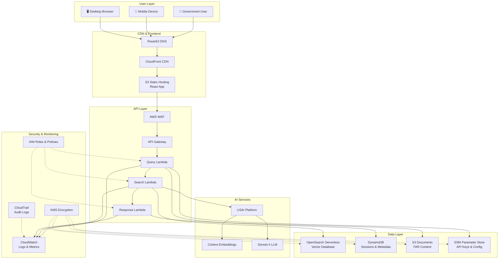

### Request Flow Sequence
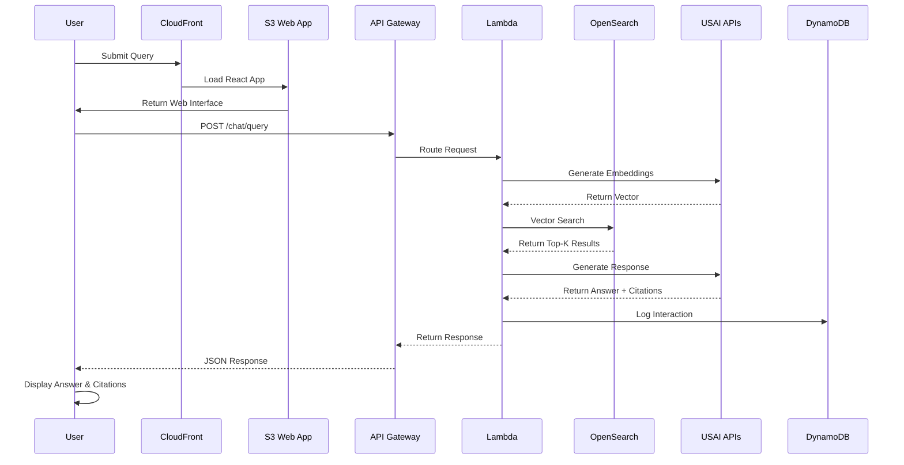

## 3. Detailed Data Flow

### Request Processing Pipeline

1. **User Interaction**
   - User submits query through React web interface
   - Static web assets (React build) served from S3 via CloudFront CDN
   - Real-time chat interface with WebSocket support (optional)
   - HTTPS-only communication enforced

2. **API Request Routing**
   - API Gateway receives POST request with query payload
   - WAF validates request against security rules
   - Request forwarded to appropriate Lambda function

3. **Query Processing**
   - Lambda function validates input and extracts query
   - Retrieves USAI API credentials from SSM Parameter Store
   - Calls Cohere embedding API to generate query vector

4. **Vector Search**
   - Query embedding searched against OpenSearch Serverless k-NN index
   - Top-k relevant document chunks retrieved (typically k=5-10)
   - Relevance scores calculated and filtered

5. **Context Assembly**
   - Retrieved chunks fetched from S3 document storage
   - Conversation history retrieved from DynamoDB (if applicable)
   - Context assembled with proper token limit management

6. **Response Generation**
   - Grounded prompt constructed with FAR context
   - Sonnet 4 API called via USAI for response generation
   - Response includes proper FAR section citations

7. **Response Delivery**
   - Generated response formatted with citations
   - Metadata logged to DynamoDB and CloudWatch
   - Response returned to user via API Gateway

8. **Audit & Monitoring**
   - All API calls logged to CloudWatch
   - Audit trail captured in CloudTrail
   - Performance metrics tracked for optimization

## 4. Frontend Architecture

### React Application Architecture
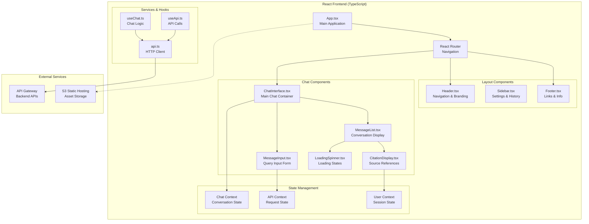

### Frontend Data Flow
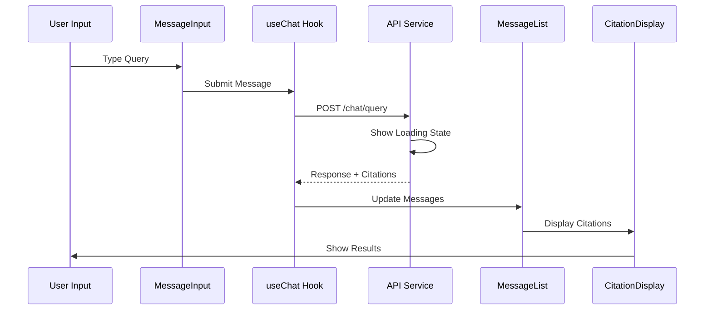

### Component Structure
```
src/
├── components/
│   ├── Chat/
│   │   ├── ChatInterface.tsx      # Main chat container
│   │   ├── MessageList.tsx        # Message history display
│   │   ├── MessageInput.tsx       # Query input with validation
│   │   ├── CitationDisplay.tsx    # FAR section references
│   │   └── LoadingSpinner.tsx     # Loading states
│   ├── Layout/
│   │   ├── Header.tsx             # App header with branding
│   │   ├── Sidebar.tsx            # Settings and history
│   │   └── Footer.tsx             # Footer with links
│   └── Common/
│       ├── ErrorBoundary.tsx      # Error handling
│       └── Button.tsx             # Reusable UI components
├── contexts/
│   ├── ChatContext.tsx            # Chat state management
│   ├── ApiContext.tsx             # API request state
│   └── UserContext.tsx            # User session state
├── hooks/
│   ├── useChat.ts                 # Chat logic and state
│   ├── useApi.ts                  # API call management
│   └── useLocalStorage.ts         # Browser storage
├── services/
│   ├── api.ts                     # HTTP client with retry
│   └── validation.ts              # Input validation
├── types/
│   ├── chat.ts                    # Chat message types
│   ├── api.ts                     # API response types
│   └── far.ts                     # FAR document types
└── utils/
    ├── formatting.ts              # Text formatting
    ├── constants.ts               # App constants
    └── helpers.ts                 # Utility functions
```

### Technology Stack
- **Framework**: React 18+ with TypeScript for type safety
- **Build Tool**: Vite for fast development and optimized builds
- **State Management**: React Context API with useReducer for complex state
- **UI Library**: Tailwind CSS for utility-first styling
- **HTTP Client**: Axios with interceptors for error handling and retries
- **Testing**: Jest + React Testing Library for unit and integration tests
- **Accessibility**: WCAG 2.1 AA compliance with aria-labels and keyboard navigation

### Deployment Architecture
```mermaid
graph LR
    subgraph "Development"
        Dev[Local Development<br/>npm run dev]
        Test[Unit Tests<br/>npm test]
        Build[Production Build<br/>npm run build]
    end
    
    subgraph "CI/CD Pipeline"
        GH[GitHub Actions<br/>Workflow Trigger]
        Lint[ESLint & TypeScript<br/>Code Quality]
        TestCI[Jest Tests<br/>Automated Testing]
        BuildCI[Vite Build<br/>Production Assets]
    end
    
    subgraph "AWS Deployment"
        S3Deploy[S3 Upload<br/>Static Assets]
        CF[CloudFront<br/>CDN Distribution]
        Invalidate[Cache Invalidation<br/>Fresh Content]
    end
    
    Dev --> Test
    Test --> Build
    Build --> GH
    GH --> Lint
    Lint --> TestCI
    TestCI --> BuildCI
    BuildCI --> S3Deploy
    S3Deploy --> CF
    CF --> Invalidate
```

## 5. Backend Architecture

### Lambda Functions Architecture
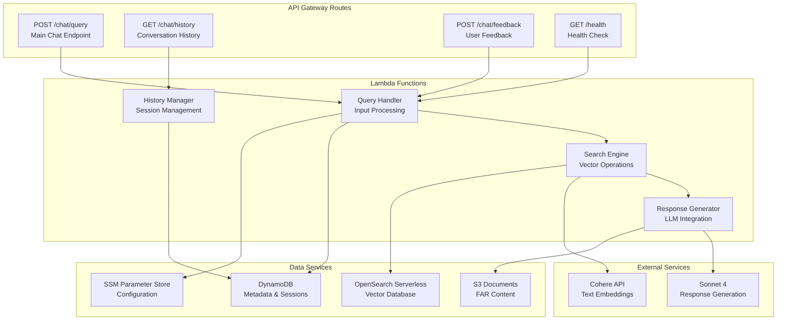

### Backend Processing Flow
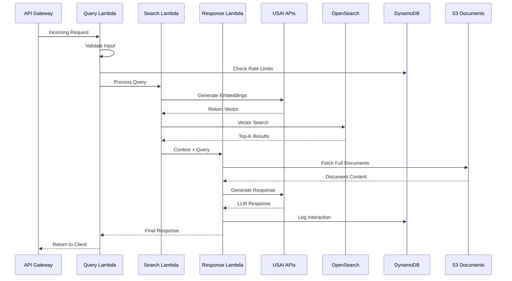

### Data Layer Architecture
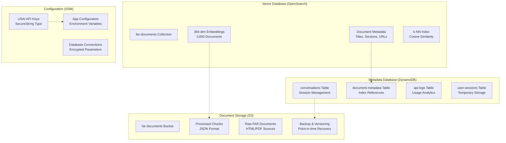

## 6. Core AWS Services

### API Gateway + Lambda
- **Purpose**: Serverless request handling and business logic
- **Usage**: 
  - API Gateway handles HTTPS endpoints and request routing
  - Lambda functions process queries, call USAI APIs, and manage data flow
  - Automatic scaling based on demand
- **Configuration**:
  - Lambda: Python 3.11 runtime, 1GB memory, 30-second timeout
  - API Gateway: REST API with CORS enabled
- **Monthly Cost**: $5-15 (100K requests/month)

### S3 Storage
- **Purpose**: Document storage and static web hosting
- **Usage**:
  - Primary bucket: FAR documents and processed chunks (~500MB)
  - Web bucket: React build artifacts (HTML, JS, CSS) (~20MB)
  - Audit bucket: CloudTrail logs and backups
- **Configuration**:
  - Standard storage class with lifecycle policies
  - Server-side encryption with KMS
  - Versioning enabled for compliance
  - Static website hosting with index.html routing
- **Monthly Cost**: $5-10

### DynamoDB
- **Purpose**: Metadata storage and session management
- **Usage**:
  - Document metadata and indexing information
  - Conversation history and user sessions
  - API usage tracking and rate limiting
- **Configuration**:
  - On-demand billing mode for variable workloads
  - Point-in-time recovery enabled
  - Encryption at rest with KMS
- **Tables**:
  - `far-documents`: Document metadata and chunk references
  - `conversations`: Session data and chat history
  - `api-logs`: Request tracking and analytics
- **Monthly Cost**: $10-30

### OpenSearch Serverless
- **Purpose**: Vector database for semantic search
- **Usage**:
  - Stores 3,893 document embeddings (384-dimensional vectors)
  - k-NN search with cosine similarity
  - Automatic scaling and management
- **Configuration**:
  - Single collection with vector and metadata fields
  - Encryption in transit and at rest
  - VPC endpoints for secure access
- **Monthly Cost**: $50-150 (depends on query volume)

### SSM Parameter Store
- **Purpose**: Secure storage of API keys and configuration
- **Usage**:
  - USAI API credentials (SecureString type)
  - Application configuration parameters
  - Environment-specific settings
- **Configuration**:
  - KMS encryption for sensitive parameters
  - IAM-based access control
  - Parameter versioning for rollback capability
- **Monthly Cost**: <$1

### CloudWatch
- **Purpose**: Logging, monitoring, and alerting
- **Usage**:
  - Lambda function logs and metrics
  - API Gateway request/response logging
  - Custom metrics for search quality and performance
  - Alarms for error rates and latency
- **Configuration**:
  - Log retention: 30 days for cost optimization
  - Custom dashboards for operational visibility
  - SNS integration for critical alerts
- **Monthly Cost**: $20-40

### CloudTrail
- **Purpose**: Audit logging and compliance
- **Usage**:
  - API call auditing across all AWS services
  - Data event logging for S3 and DynamoDB
  - Compliance reporting and forensic analysis
- **Configuration**:
  - Single trail covering all regions
  - S3 bucket with MFA delete protection
  - Log file validation enabled
- **Monthly Cost**: $10-20

### Route53
- **Purpose**: DNS management and health checks
- **Usage**:
  - Custom domain routing to CloudFront
  - Health checks for API endpoints
  - Failover routing for high availability
- **Configuration**:
  - Hosted zone for custom domain
  - A/AAAA records pointing to CloudFront
  - Health checks with SNS notifications
- **Monthly Cost**: $0.50-2

## 5. Security & Compliance

### Identity & Access Management
- **Principle of Least Privilege**: Each service granted minimal required permissions
- **Service-Specific Roles**:
  - Lambda execution role: Access to DynamoDB, S3, OpenSearch, SSM
  - API Gateway role: CloudWatch logging permissions
  - CloudTrail role: S3 bucket write permissions
- **Cross-Service Access**: Service-to-service authentication via IAM roles
- **User Access**: No direct AWS console access required for end users

### Encryption Strategy
- **Data at Rest**:
  - S3: SSE-KMS with customer-managed keys
  - DynamoDB: Encryption with AWS managed KMS keys
  - OpenSearch: Encryption at rest enabled
  - Parameter Store: SecureString parameters with KMS
- **Data in Transit**:
  - HTTPS enforced for all API communications
  - TLS 1.2+ for all service-to-service communication
  - VPC endpoints for internal AWS service communication

### Network Security
- **Public Access Points**:
  - CloudFront distribution (HTTPS only)
  - API Gateway (with WAF protection)
- **Private Resources**:
  - Lambda functions in default VPC (no custom VPC for MVP)
  - DynamoDB and S3 accessed via AWS backbone
- **WAF Rules**:
  - Rate limiting per IP address
  - SQL injection and XSS protection
  - Geographic restrictions if required

### Audit & Compliance
- **CloudTrail Configuration**:
  - All API calls logged with data events
  - Log file integrity validation
  - Multi-region trail for comprehensive coverage
- **Data Retention**:
  - CloudWatch logs: 30 days
  - CloudTrail logs: 1 year minimum
  - No persistent storage of user queries (session-only)
- **Compliance Controls**:
  - No PII collection or storage
  - Session-based conversation history
  - Automatic log rotation and archival

## 7. Security & Compliance Architecture

### Security Layer Overview
```mermaid
graph TB
    subgraph "Network Security"
        WAF[AWS WAF<br/>Web Application Firewall]
        CF[CloudFront<br/>DDoS Protection]
        HTTPS[HTTPS Only<br/>TLS 1.2+]
    end
    
    subgraph "Identity & Access"
        IAM[IAM Roles & Policies<br/>Least Privilege]
        Cognito[AWS Cognito<br/>User Authentication]
        MFA[Multi-Factor Auth<br/>Government Users]
    end
    
    subgraph "Data Protection"
        KMS[AWS KMS<br/>Encryption Keys]
        S3Encrypt[S3 Encryption<br/>SSE-KMS]
        DBEncrypt[DynamoDB Encryption<br/>At Rest & Transit]
        OSEncrypt[OpenSearch Encryption<br/>Node-to-node TLS]
    end
    
    subgraph "Monitoring & Audit"
        CloudTrail[AWS CloudTrail<br/>API Audit Logs]
        CloudWatch[CloudWatch<br/>Security Metrics]
        GuardDuty[GuardDuty<br/>Threat Detection]
        Config[AWS Config<br/>Compliance Rules]
    end
    
    subgraph "Compliance Controls"
        FISMA[FISMA Compliance<br/>Federal Standards]
        FedRAMP[FedRAMP Controls<br/>Cloud Security]
        NIST[NIST Framework<br/>Cybersecurity]
    end
    
    WAF --> CF
    CF --> HTTPS
    IAM --> Cognito
    Cognito --> MFA
    KMS --> S3Encrypt
    KMS --> DBEncrypt
    KMS --> OSEncrypt
    CloudTrail --> CloudWatch
    CloudWatch --> GuardDuty
    GuardDuty --> Config
    
    FISMA -.-> FedRAMP
    FedRAMP -.-> NIST
```

### Data Flow Security
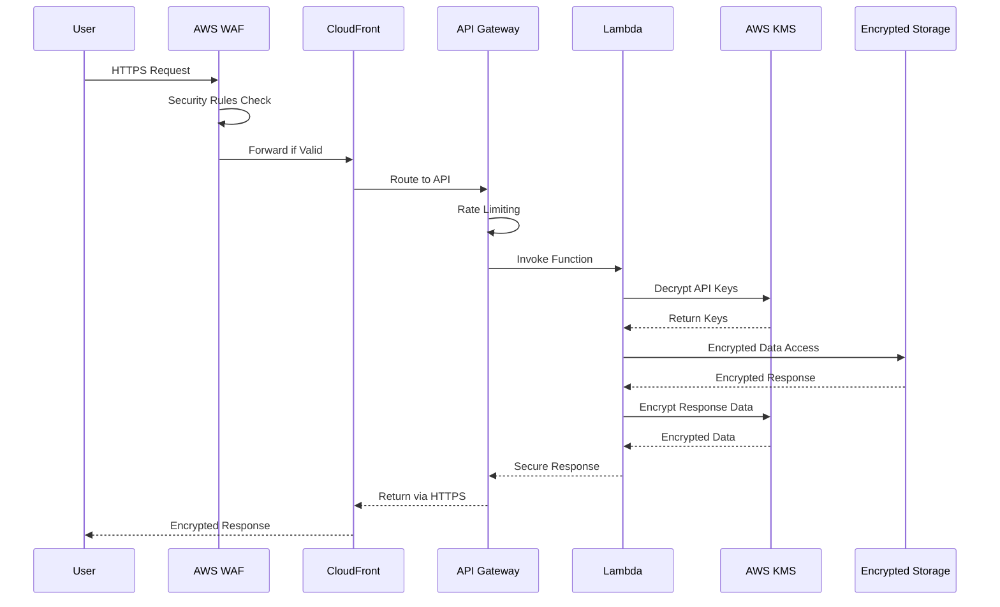

## 8. Networking Architecture

### MVP Approach: Public Lambda
- **Rationale**: Cost optimization for initial deployment
- **Configuration**:
  - Lambda functions run in AWS-managed VPC
  - Internet access for USAI API calls
  - No NAT Gateway costs (~$45/month savings)
- **Security Considerations**:
  - All external API calls over HTTPS
  - IAM roles control AWS service access
  - No inbound network access to Lambda functions

### Service Communication
- **AWS Service Access**: Via AWS backbone (no internet routing)
- **External API Access**: HTTPS to USAI endpoints
- **VPC Endpoints**: Optional future enhancement for DynamoDB/S3

### Future Private Networking
- **Phase 2 Enhancement**: Custom VPC with private subnets
- **Components**:
  - Lambda functions in private subnets
  - NAT Gateway for outbound internet access
  - VPC endpoints for AWS services
- **Additional Cost**: ~$50-70/month for NAT and endpoints

## 7. Cost Analysis

### Monthly Cost Breakdown (MVP Scale: ~1,000 queries/month)

| Service | Usage | Monthly Cost |
|---------|--------|--------------|
| **Lambda** | 1K invocations, 1GB memory | $5 |
| **API Gateway** | 1K requests | $3 |
| **S3 Storage** | 1GB documents + web assets | $5 |
| **DynamoDB** | On-demand, light usage | $15 |
| **OpenSearch Serverless** | 1 collection, light queries | $75 |
| **CloudWatch** | Standard logging | $25 |
| **CloudTrail** | Single trail | $15 |
| **Route53** | 1 hosted zone | $1 |
| **KMS** | Key usage | $3 |
| **Data Transfer** | CloudFront + API | $5 |
| **USAI API Costs** | Cohere + Sonnet 4 | $50-100 |
| **Total** | | **$202-252** |

### Scaling Projections

| Monthly Queries | Total Cost | Cost per Query |
|----------------|------------|----------------|
| 1,000 | $225 | $0.23 |
| 5,000 | $275 | $0.06 |
| 10,000 | $350 | $0.04 |
| 25,000 | $500 | $0.02 |

### Cost Optimization Strategies
- **Reserved Capacity**: DynamoDB reserved capacity for predictable workloads
- **S3 Lifecycle**: Transition old logs to cheaper storage classes
- **CloudWatch**: Optimize log retention periods
- **Caching**: Implement response caching for common queries

## 9. Cost Analysis & Optimization

### Cost Breakdown Visualization
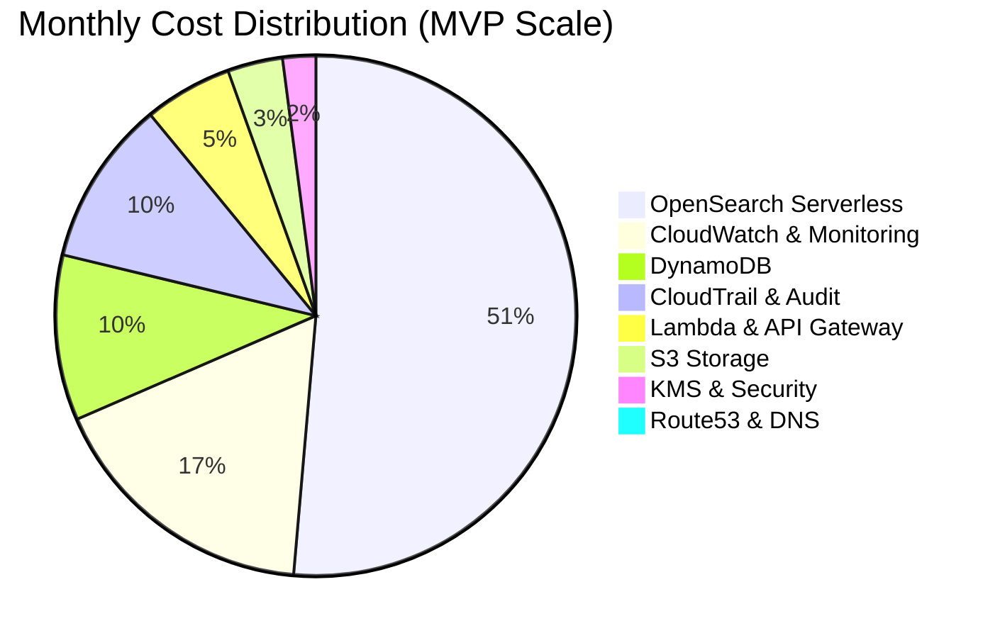

### Scaling Cost Projections
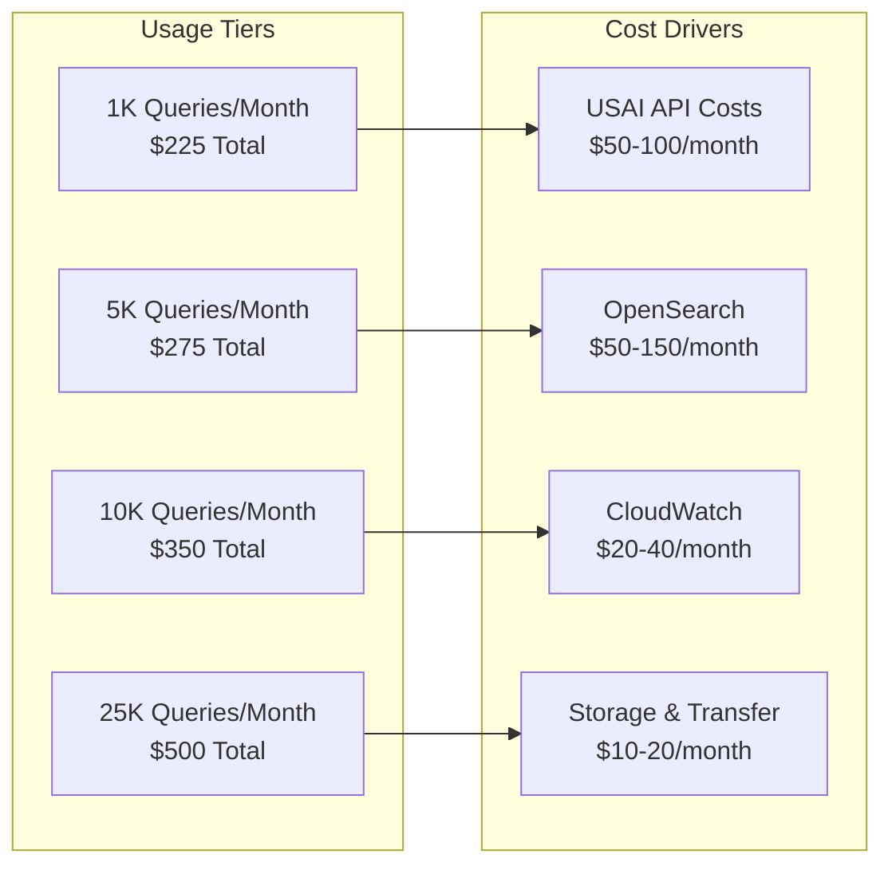

## 10. Deployment Strategy

### Infrastructure as Code
- **Tool**: AWS CDK (TypeScript) or Terraform
- **Benefits**:
  - Version-controlled infrastructure
  - Repeatable deployments across environments
  - Automated rollback capabilities
- **Repository Structure**:
  ```
  far-chatbot/
  ├── frontend/                 # React application
  │   ├── src/
  │   ├── public/
  │   ├── package.json
  │   └── vite.config.ts
  ├── backend/                  # Lambda functions
  │   ├── src/
  │   ├── requirements.txt
  │   └── serverless.yml
  ├── infrastructure/           # IaC templates
  │   ├── environments/
  │   │   ├── dev.yaml
  │   │   ├── staging.yaml
  │   │   └── prod.yaml
  │   ├── stacks/
  │   │   ├── frontend-stack.ts
  │   │   ├── api-stack.ts
  │   │   ├── data-stack.ts
  │   │   └── security-stack.ts
  │   └── deploy.sh
  └── .github/workflows/        # CI/CD pipelines
      ├── frontend-deploy.yml
      └── backend-deploy.yml
  ```

### CI/CD Pipeline
- **Platform**: GitHub Actions
- **Frontend Pipeline**:
  1. **Source**: React code changes trigger pipeline
  2. **Install**: npm install dependencies
  3. **Lint & Test**: ESLint, TypeScript check, Jest tests
  4. **Build**: Production React build (npm run build)
  5. **Deploy**: Upload to S3, invalidate CloudFront
- **Backend Pipeline**:
  1. **Source**: Python code changes trigger pipeline
  2. **Test**: Unit tests and integration tests
  3. **Package**: Lambda deployment packages
  4. **Deploy Dev**: Automated deployment to development
  5. **Deploy Staging**: Manual approval required
  6. **Deploy Prod**: Manual approval with additional checks

### Environment Strategy
- **Development**: 
  - Reduced capacity OpenSearch
  - Shorter log retention
  - Relaxed security for testing
- **Staging**:
  - Production-like configuration
  - Full security controls
  - Performance testing environment
- **Production**:
  - Full capacity and redundancy
  - Complete audit logging
  - Strict security controls

### Deployment Process
1. **Pre-deployment**:
   - Backup current vector index
   - Validate new document embeddings
   - Run integration tests
   - Build and test React frontend
2. **Blue-Green Deployment**:
   - Build React app for production
   - Deploy static assets to S3
   - Deploy new Lambda versions
   - Update API Gateway to new versions
   - Update CloudFront distribution
   - Monitor error rates and latency
3. **Post-deployment**:
   - Verify search functionality
   - Test frontend functionality
   - Check audit logs
   - Update monitoring dashboards

### Rollback Strategy
- **Lambda**: Automatic rollback on error rate threshold
- **API Gateway**: Instant version switching
- **Vector Index**: Restore from S3 backup
- **Database**: Point-in-time recovery if needed

### CI/CD Pipeline Architecture
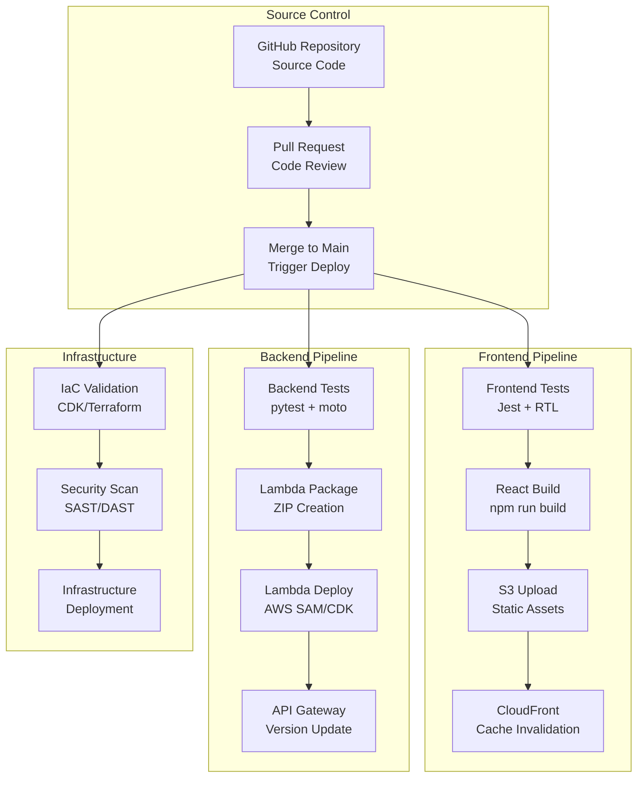

### Environment Promotion Flow
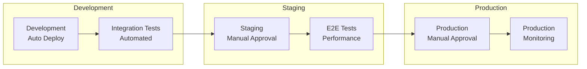

## 11. Monitoring & Operations

### Key Performance Indicators
- **Response Time**: <3 seconds for 95th percentile
- **Availability**: 99.9% uptime target
- **Search Accuracy**: >85% user satisfaction
- **Error Rate**: <1% of total requests

### Monitoring Stack
- **CloudWatch Dashboards**:
  - API performance metrics
  - Lambda execution statistics
  - Search quality indicators
  - Cost tracking and optimization
- **Alarms**:
  - High error rates (>5% in 5 minutes)
  - Elevated latency (>5 seconds average)
  - USAI API failures
  - Unusual cost spikes

### Operational Procedures
- **Daily**: Review error logs and performance metrics
- **Weekly**: Analyze search quality and user feedback
- **Monthly**: Cost optimization review and capacity planning
- **Quarterly**: Security audit and compliance review

### Monitoring Dashboard Architecture
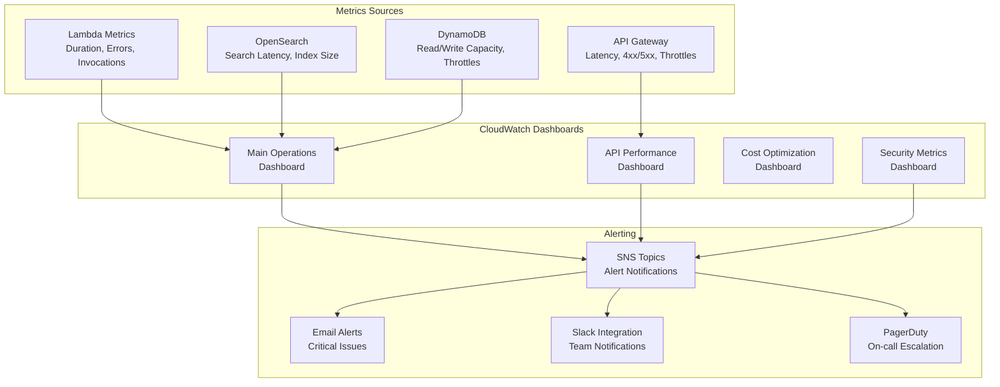

### Operational Procedures Flow
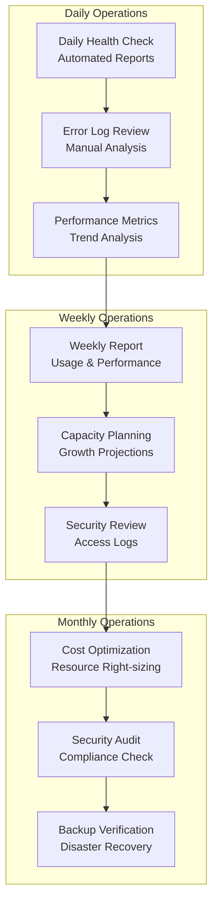

## 12. Future Enhancements

### Phase 2: Enhanced Security
- **Private Networking**:
  - Custom VPC with private subnets
  - VPC endpoints for AWS services
  - Network ACLs and security groups
- **Advanced Authentication**:
  - Integration with government identity providers
  - Multi-factor authentication
  - Role-based access control

### Phase 3: Advanced Features
- **Hybrid Search**:
  - Combine semantic and keyword search
  - Elasticsearch integration
  - Advanced ranking algorithms
- **Multi-modal Support**:
  - PDF document processing
  - Image and diagram analysis
  - Voice input capabilities

### Phase 4: Scale & Performance
- **Containerization**:
  - EKS deployment for high-scale scenarios
  - Auto-scaling based on demand
  - Blue-green deployments
- **Advanced Analytics**:
  - User behavior tracking
  - Search optimization insights
  - Predictive scaling

### Phase 5: Integration & Ecosystem
- **API Platform**:
  - Public REST API for integrations
  - Webhook support for notifications
  - SDK development for common languages
- **Enterprise Features**:
  - Custom domain branding
  - Advanced reporting and analytics
  - Integration with procurement systems

### Enhancement Roadmap
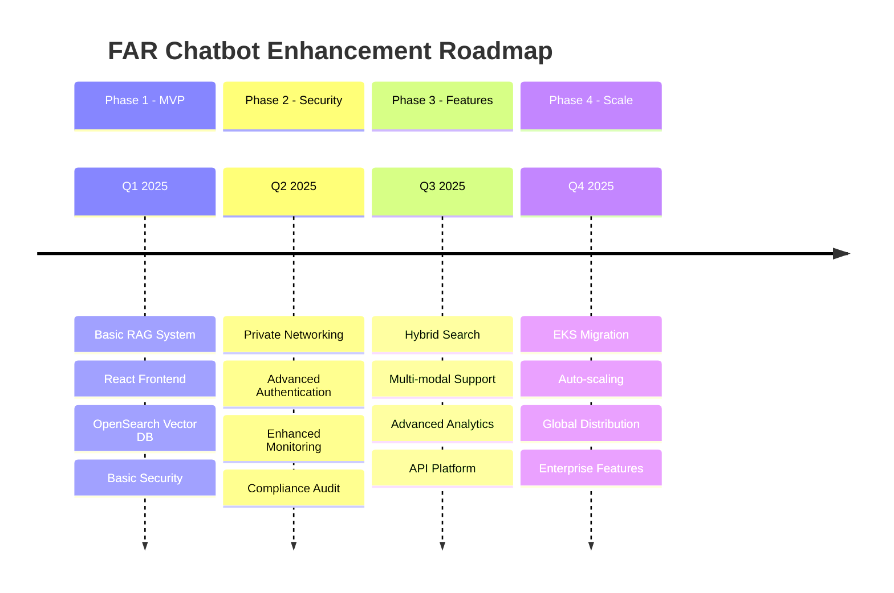

### Future Architecture Evolution
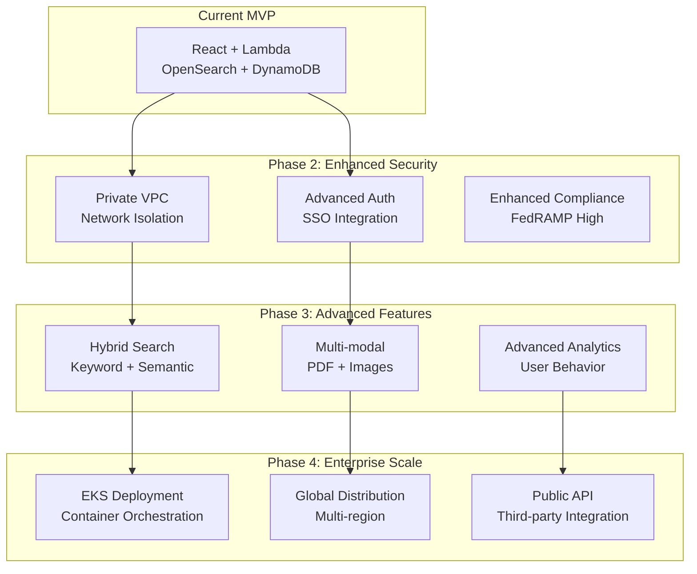

## 13. Risk Assessment & Mitigation

### Technical Risks
- **USAI API Availability**: Implement circuit breakers and fallback responses
- **Vector Index Corruption**: Regular backups and validation procedures
- **Cost Overruns**: Automated budget alerts and usage caps

### Security Risks
- **Data Breach**: Encryption at rest/transit, minimal data retention
- **API Abuse**: Rate limiting, WAF rules, monitoring
- **Insider Threats**: Least privilege access, audit logging

### Operational Risks
- **Service Outages**: Multi-AZ deployment, automated failover
- **Performance Degradation**: Auto-scaling, performance monitoring
- **Compliance Violations**: Regular audits, automated compliance checks

This production design provides a comprehensive blueprint for deploying the FAR Chatbot MVP in a government-compliant environment while maintaining cost efficiency and scalability for future growth.